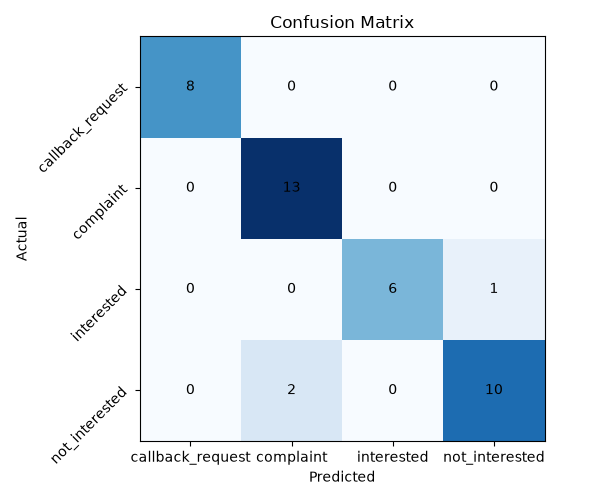

# Call Intent Classifier

This project demonstrates a complete ML pipeline for classifying the intent 
of phone calls (mortgage lead generation): whether a client is interested 
in the offer, declines, asks for a callback, or complains about the calls 
themselves.

## Why this task (Motivation)

For companies that work with leads (such as in the mortgage industry), it's 
important to quickly understand which clients are genuinely interested in 
working together and which ones want to be left alone — this helps 
prioritize calls correctly and avoid wasting resources on uninterested 
clients.

## Data

The dataset contains 50 examples for each of the 4 categories 
(callback_request, complaint, interested, not_interested).

Synthetic data was used instead of real transcripts, since real mortgage 
industry call recordings are protected by NDAs and client privacy — there 
is no open dataset of this kind available.

Synthetic data, of course, doesn't produce the same results as real 
conversations, so I added "borderline" phrases — examples that deliberately 
sound ambiguous between neighboring categories (for example, a refusal that 
sounds almost like a complaint), so the model wouldn't learn from data 
that's too simple.

## Approach / Pipeline

1. Dataset generation: for each category, a phrase is randomly selected 
   from a prepared list, then conversational "noise" is added (fillers like 
   "um", "you know") for naturalness
2. Train/test split: 80%/20% of the data for training, the rest for testing
3. Text vectorization using TF-IDF
4. Training a Logistic Regression model
5. Evaluation through metrics (accuracy, precision/recall/F1) and a 
   confusion matrix
6. Visualization of the confusion matrix as a chart

**Why Logistic Regression:** this model is simple, easily interpretable 
(you can see which words influence each category the most) and works well 
on small amounts of data. A more complex model (e.g. a neural network) 
would likely overfit on this amount of data (~200 examples).

## Results

Accuracy: 0.925

This is a realistic result for synthetic data. If a model shows 100% 
accuracy on a dataset like this, it's more likely a sign that it just 
memorized a limited number of templates rather than learning to recognize 
meaning.

The confusion matrix showed that the model most often confuses 
`not_interested` and `complaint` — which makes sense, since both 
categories are semantically close ("I'm not interested" and "stop calling 
me" sound similar).



## How to run

```bash
pip install -r requirements.txt
python generate_dataset.py
python train_classifier.py
```

## Future improvements

- Collect real (anonymized) data instead of synthetic
- Try other models (e.g. Random Forest or Naive Bayes) and compare results
- Add cross-validation instead of a single train/test split


# Call Intent Classifier

Проєкт демонструє повний ML pipeline для класифікації інтенту телефонних 
дзвінків (mortgage lead generation): чи клієнт цікавиться пропозицією, 
відмовляється, просить передзвонити, чи скаржиться на самі дзвінки.

## Чому ця задача (Motivation)

Компаніям, що працюють з лідами (як у mortgage-індустрії), важливо швидко 
розуміти, хто з клієнтів дійсно зацікавлений у співпраці, а хто просить 
не дзвонити — це допомагає правильно пріоритизувати дзвінки і не витрачати 
ресурс на незаінтересованих клієнтів.

## Дані

Датасет містить 50 прикладів на кожну з 4 категорій 
(callback_request, complaint, interested, not_interested).

Використано синтетичні дані замість реальних транскриптів, оскільки реальні 
записи дзвінків по mortgage-індустрії захищені NDA і приватністю клієнтів — 
відкритого датасету такого типу немає.

Синтетичні дані звісно не дають такого ж результату, як реальні розмови, 
тому я додала "межові" фрази — приклади, які навмисно звучать неоднозначно 
між сусідніми категоріями (наприклад, відмова, що звучить майже як скарга), 
щоб модель не вчилась на занадто простих даних.

## Підхід / Pipeline

1. Генерація датасету: для кожної категорії випадково обирається фраза 
   з підготовленого списку, до неї додається розмовний "шум" (філлери типу 
   "um", "you know") для природності
2. Train/test split: 80%/20% даних для навчання, решта для тесту
3. Векторизація тексту через TF-IDF 
4. Навчання моделі Logistic Regression
5. Оцінка через метрики (accuracy, precision/recall/F1) та confusion matrix
6. Візуалізація confusion matrix у вигляді графіка

**Чому Logistic Regression:** ця модель проста, добре пояснювана (можна 
подивитись, які слова найбільше впливають на кожну категорію) і добре 
працює на малих обʼємах даних. Складніша модель (наприклад нейромережа) 
на такій кількості даних (~200 прикладів) швидше перенавчиться.

## Результати

Accuracy: 0.925

Це реалістичний результат для синтетичних даних. Якщо модель показує 
100% точність на такому датасеті — це швидше ознака того, що вона просто 
запам'ятала обмежену кількість шаблонів, а не навчилась розпізнавати сенс.

Confusion matrix показала, що модель найчастіше плутає `not_interested` 
і `complaint` — це логічно, бо обидві категорії семантично близькі 
("я не хочу" і "перестаньте дзвонити" звучать схоже).


## Як запустити

```bash
pip install -r requirements.txt
python generate_dataset.py
python train_classifier.py
```

## Що можна покращити далі

- Зібрати реальні (анонімізовані) дані замість синтетичних
- Спробувати інші моделі (наприклад Random Forest або Naive Bayes) 
  і порівняти результати
- Додати крос-валідацію замість одного train/test split